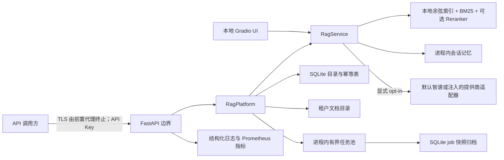
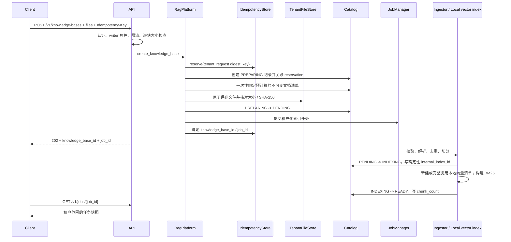
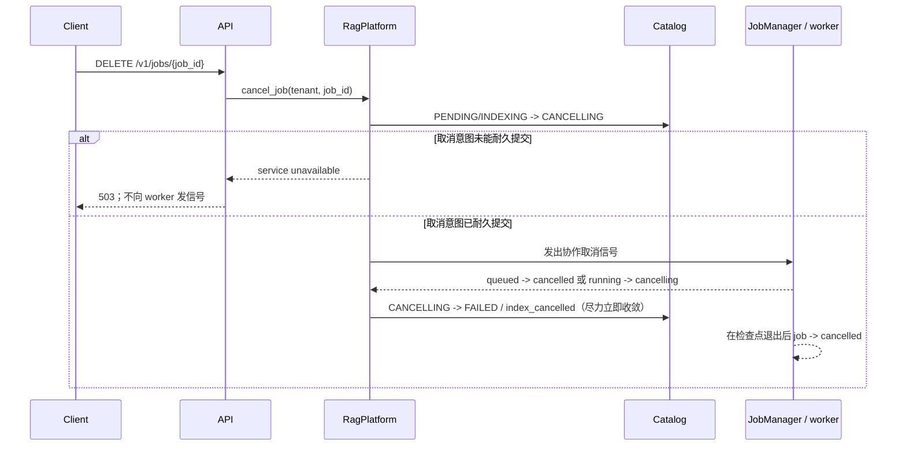
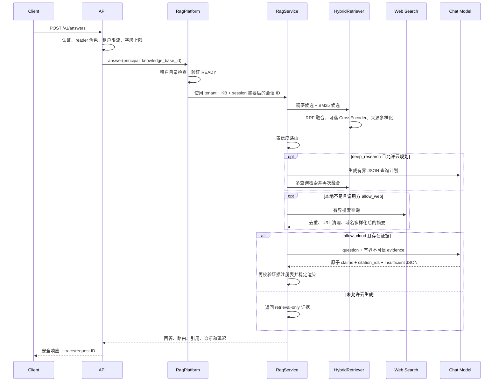

# 系统架构

本文描述 `rag-studio` 当前代码所实现的边界。生产形态是一个可持久化的单节点服务：FastAPI 进程、进程内工作线程、SQLite 元数据、租户文件目录和受限本地向量索引共享同一持久卷。它不是无共享的分布式系统，也不应把本文当作尚未执行的性能或安全测试报告。

## 设计目标

- 文档、索引和问答资源始终处于经过认证的租户边界内。
- 默认不把问题或证据发送到云端；调用方必须逐次允许云生成和联网搜索。
- 建库采用异步任务，问答采用同步请求，并为两条路径设置显式资源上限。
- 检索、路由、生成和引用是可替换模块，而 HTTP、存储和供应商协议不会侵入领域对象。
- 单进程重启后可以从原始文档、SQLite 目录和持久化向量索引恢复知识库；`PREPARING` 会核验后继续或回滚，`PENDING`/`INDEXING` 会重新提交，`CANCELLING` 会终态化，旧 worker 不会恢复执行，但有界 job 快照和 ID 会保留为可查询历史。

## 上下文与信任边界



HTTP 入口不提供 TLS；公网部署必须使用受控反向代理。上传文档、网页搜索摘要和模型输出都属于不可信数据。内置 `ZhipuProviderFactory` 是默认云端实现；派生项目可以在组合根显式注入自己的 `ProviderFactory`，但不能用环境变量动态加载代码。`ZHIPU_CHAT_URL` 与 `ZHIPU_SEARCH_URL` 是默认实现的受信运维配置，而不是终端用户输入。

## 模块边界

| 边界 | 当前职责 | 不负责 |
| --- | --- | --- |
| [`application.py`](../rag_system/application.py) | 向 HTTP、CLI、后台入口和未来 Agent 暴露框架无关的用例端口、提交 DTO 与稳定应用错误 | FastAPI、SQLite、向量后端或供应商实现 |
| [`api.py`](../rag_system/api.py)、[`api_contract.py`](../rag_system/api_contract.py)、[`api_errors.py`](../rag_system/api_errors.py) | API Key/Bearer 接入、角色检查、版本化 wire schema、上传读取、租户限流、集中错误分类、安全响应头、健康检查和 `/metrics` | 文档解析、索引算法、业务状态迁移或具体平台实现 |
| [`tenancy.py`](../rag_system/tenancy.py) | `Principal`、`TenantId`、仅保存摘要的 API Key 校验和非枚举式拒绝 | 密钥签发、在线撤销、组织级 IAM |
| [`platform.py`](../rag_system/platform.py) | 应用门面：知识库生命周期、幂等创建、任务提交、重启恢复、租户化索引与会话标识的用例编排 | HTTP 协议、文档内容校验细节和索引状态机细节 |
| [`submission.py`](../rag_system/submission.py)、[`coordination.py`](../rag_system/coordination.py) | 上传的有界物化与稳定摘要、文档 ID 策略、确定性分片锁和一致的双向 resource-job 登记 | 文件持久化、任务执行和 HTTP multipart 解析 |
| [`assets.py`](../rag_system/assets.py)、[`indexing.py`](../rag_system/indexing.py) | Catalog 清单与文件结果核对、路径/哈希完整性、耐久索引状态迁移、取消收敛和失败补偿 | API 鉴权、问答路由或供应商调用 |
| [`catalog.py`](../rag_system/catalog.py) | SQLite schema v4 中租户范围的知识库状态机、显式上传准备阶段、耐久取消意图与不可变文档清单 | 文档正文、向量或耐久任务执行日志 |
| [`idempotency.py`](../rag_system/idempotency.py) | SQLite 中按租户、操作和 key 隔离的创建请求预留与结果绑定 | 任务结果持久化 |
| [`file_store.py`](../rag_system/file_store.py) | 有界、不可穿越、拒绝链接/重解析点的租户文件保存、解析和精确删除 | 文档格式解析 |
| [`job_contracts.py`](../rag_system/job_contracts.py)、[`jobs.py`](../rag_system/jobs.py)、[`job_store.py`](../rag_system/job_store.py) | 框架无关任务契约、有界线程池、租户隔离执行、协作取消，以及 SQLite 中有界的状态/结果快照归档 | 跨进程任务分发、恢复旧 Python callable 或分布式公平队列 |
| [`loaders.py`](../rag_system/loaders.py)、[`ingestion.py`](../rag_system/ingestion.py) | 多格式安全解析、去重、确定性切分、清单和索引 ID | 向量搜索或生成 |
| [`retrieval.py`](../rag_system/retrieval.py)、[`sparse.py`](../rag_system/sparse.py)、[`ranking.py`](../rag_system/ranking.py) | 受限本地余弦检索、BM25 稀疏检索、RRF 融合、可解释置信度和路由 | 供应商调用 |
| [`reranking.py`](../rag_system/reranking.py) | 可选 CrossEncoder 二阶段重排及失败回退 | 默认必需依赖 |
| [`service.py`](../rag_system/service.py)、[`research.py`](../rag_system/research.py) | 多轮查询上下文化、多查询研究模式、隐私路由、证据组装、生成和引用审计 | 具体模型供应商、租户资源所有权和磁盘布局 |
| [`answer_protocol.py`](../rag_system/answer_protocol.py)、[`grounding.py`](../rag_system/grounding.py)、[`provider_errors.py`](../rag_system/provider_errors.py) | 供应商无关的提示/证据边界、结构化回答解码、引用不变量和稳定失败契约 | HTTP、智谱字段与 UI 框架 |
| [`provider_factory.py`](../rag_system/provider_factory.py)、[`providers.py`](../rag_system/providers.py)、[`web.py`](../rag_system/web.py) | 提供商无关的适配器装配契约、内置智谱默认工厂、HTTP 传输、超时/重试/结束状态解析、网页结果去重与域名多样性 | 应用编排、回答 schema 的具体解释、任意 URL 抓取 |
| [`memory.py`](../rag_system/memory.py) | TTL/LRU 有界的进程内会话历史 | 耐久会话或跨副本共享 |
| [`observability.py`](../rag_system/observability.py)、[`metrics.py`](../rag_system/metrics.py) | 字段白名单 JSON 事件、低基数指标和关联 ID | 文档/问题正文日志或分布式追踪后端 |
| [`bootstrap.py`](../rag_system/bootstrap.py) | 本地 UI 与生产 API 的依赖组装、严格凭据解析、启动恢复 | 运行时迁移编排 |

领域对象和协议集中在 [`domain.py`](../rag_system/domain.py)、[`ports.py`](../rag_system/ports.py) 与 [`application.py`](../rag_system/application.py)。HTTP 只依赖应用端口；具体平台可以在组合根替换。架构测试同时禁止生产模块导入环、HTTP 反向依赖平台/存储实现，以及领域协议引入 Web、数据库或模型框架。

## 异步建库数据流



### 取消与提交竞态



Catalog 的 `CANCELLING` 与 job 的 `cancelling` 含义不同：前者是 schema v4 中的耐久知识库取消意图，后者是当前进程的执行状态，同时会归档到 job 快照库。正常路径会在发出信号后尽力把知识库立即写成 `FAILED`/`index_cancelled`，但运行中的 worker 在真正退出前仍占用任务容量。如果终态写入失败或进程中断，启动恢复不会重新提交该知识库；同一创建请求的幂等重放会通过统一的恢复工作流，把残留 `CANCELLING` 收敛为 `FAILED`/`index_cancelled`，并在需要时轮换成新的可轮询 job。若 durable reservation 尚未绑定，或旧 job 已从当前进程淘汰，工作流仍只会绑定同一资源，绝不将幂等 key 指向其他知识库。

`READY` 是不可被取消覆盖的 durable commit point。取消到达时若 Catalog 已经是 `READY`，平台不会写入知识库 `CANCELLING`；它仍可向尚未返回的进程内 job 发出信号，因此客户端可能短暂看到 job `cancelling`，但提交成功的任务最终为 `succeeded`，知识库继续保持 `READY`。

关键不变量：

1. 创建请求摘要覆盖知识库名称、文件名和文件内容 SHA-256；同一租户和幂等 key 的不同请求会冲突。持久 reservation 的有效窗口为 24 小时，过期后的 key 会被当作新请求。
2. `PREPARING` 与 `PENDING` 不再混用：完整计划清单在 `PREPARING` 中一次性绑定，文件写到临时路径并原子移动，全部核验后才提交 `PENDING`。硬崩溃后，完整上传会继续建库，部分上传会通过清单精确回滚；清理失败则保留 `DELETING` 墓碑和原幂等预留，禁止重复创建。
3. `internal_index_id` 包含租户/知识库命名空间、文档身份、Embedding 模型和切分参数；外部 API 不暴露该标识。
4. 本地向量清单若恰好包含预期 chunk ID 集合、匹配模型标识且向量维度有效则直接复用；缺失或不匹配时从原文重建。
5. 对 `PENDING`/`INDEXING` 的取消必须先耐久提交 Catalog `CANCELLING`，再向 worker 发信号。任务只在显式检查点响应取消，正在执行的第三方库调用不保证立即中断；`READY` 提交后到达的取消不会回滚知识库。

文件系统、SQLite 和本地向量文件之间没有跨资源 ACID 事务。实现通过显式 `PREPARING`、不可变清单、内容校验、原子索引替换、可重试删除和失败补偿降低不一致概率；启动恢复会以稳定 keyset 分页扫描全部已知租户资源，验证并继续完整的 `PREPARING`、精确回滚部分上传、清理 `DELETING`、把 `CANCELLING` 终态化为 `FAILED`/`index_cancelled`、重新提交 `PENDING`/`INDEXING`，并用持久 reservation 修复资源与新进程任务的绑定。运维仍需监控长期停留状态并使用一致性备份。

## 同步问答数据流



路由被拆成两个独立阶段。第一阶段由 [`routing.py`](../rag_system/routing.py) 判断问题需要普通知识、实时信息、当前系统不支持的外部动作，还是明确受限的能力；它只输出稳定规则 ID，不记录问题正文。实时请求根据 `allow_web` 联网或拒答，外部副作用与受限请求直接失败关闭。该规则分类器通过协议注入，将来可以替换成版本化分类模型，而不改检索或生成服务。

第二阶段只处理普通知识问题。证据置信度不是直接照搬向量距离，也不是“两个检索器都命中就固定加分”：当前实现组合融合后第一名分数、第一名与第二名的间隔，以及乘以 BM25 词法覆盖支撑度的稠密/稀疏一致性。本地或混合回答还必须满足稠密/稀疏一致，或达到最低原始词法匹配 `RAG_ROUTING_MIN_LEXICAL_SCORE`；这避免单个稀疏候选的偶然词重合被当作充分证据。默认本地阈值为 `0.59`，`hybrid` 只覆盖该阈值以下 95% 到阈值之间的窄区间；证据更弱时根据请求级 `allow_web` 选择联网或拒答。阈值由新增通用 hard negatives 的 development/validation 分布校准，并由离线质量门禁防止静默回归，不能视为跨模型、跨语料通用常数。

生成边界由 [`answer_protocol.py`](../rag_system/answer_protocol.py) 和 [`grounding.py`](../rag_system/grounding.py) 共同定义。前者负责供应商无关的提示、证据预算、严格 JSON 解码和 claim schema，后者负责领域级引用不变量与稳定渲染；适配器只负责运输消息、关闭随机采样并解释上游完成状态。内置 `ZhipuChatModel` 通过 `AnswerProtocol` 注入协议；其他 `ProviderFactory` 同样可复用这一信任边界，修改 prompt/schema 也不需要改 HTTP 重试代码。供应商只能返回 `claims[]` 与显式 `insufficient` 状态；每个 claim 是不含引用标记的原子文本和一个或多个 `citation_ids`。生成提示只允许保留直接回答问题所需的事实，普通问答以 1–6 个 claim 为软预算，硬边界仍由 schema 控制。协议先执行严格 JSON/schema 校验，应用服务再以本次证据注册表重复验证，最后才渲染兼容文本。长度截断、空正文及可修复 schema 错误最多进行一次不携带原始错误输出的协议重试；安全拒绝、认证和网络错误不会进入该重试，第二次失败后整体失败关闭。系统不会截短 claim 或删除非法编号来“修复”不可信回答，因为两种局部改写都可能改变结论或让它失去依据。API 保留 claim 到证据的映射，界面文本只是该结构的确定性投影。

应用服务和 HTTP 层只依赖 [`provider_errors.py`](../rag_system/provider_errors.py) 的稳定失败契约，不反向导入具体 Provider。领域与协议模块禁止引入 FastAPI、Pydantic、Requests、LangChain 或 Gradio；[`test_architecture.py`](../tests/test_architecture.py) 会在 CI 中锁定这些依赖方向。

最近最多三轮的**用户问题**会加入检索查询；此前生成的答案不会作为检索依据。会话存储受轮数、字符数、TTL 和 LRU 容量限制。`allow_cloud` 与 `allow_web` 是请求级开关；默认值均为关闭。研究模式提高多查询和外部调用预算，但仍受配置上限约束。

## 删除流程

删除知识库时，平台先请求取消已知任务，再将目录状态迁移到 `DELETING`，随后删除内存中或持久化的本地向量索引、逐个删除清单中的原始文档，最后删除目录记录。删除会话只清除进程内对应会话摘要。

这是应用层最佳努力删除，不等于全域即时擦除：备份、已经传给外部供应商的数据、上游保留副本和已有运维日志须按各自保留策略处理。中途故障可能留下 `DELETING` 记录，需要运维处置；不得通过手工删除未知路径来“修复”。

## 持久性与运行时状态

生产组合根要求 `RAG_PERSIST_DATA=true`。`RAG_STORAGE_ROOT` 下的核心数据为：

```text
<storage-root>/
├── catalog.sqlite3       # schema v4：准备/索引状态、耐久取消与不可变文档清单
├── idempotency.sqlite3   # 创建请求预留与结果绑定
├── jobs.sqlite3          # 有界、租户隔离的 job 状态与结果快照归档
├── .rag-studio.instance  # 单节点进程独占锁文件
├── documents/            # tenant-<sha256>/<document-resource>/<filename>
└── vector/               # 原子写入的本地向量索引文件
```

Catalog 以 SQLite `user_version=4` 标识当前 schema。全新空存储会直接初始化为 v4；已有 schema v2/v3 会在启动时自动、事务化地重建为 v4，以支持显式 `PREPARING`。未知版本以及带旧表的未版本化数据库会被拒绝。迁移不会把 JobManager 变成耐久队列，旧程序也不能读取 v4，因此升级和回滚必须使用停写后的完整卷快照。

| 状态 | 是否持久 | 重启行为 |
| --- | --- | --- |
| 原始文档、目录记录、幂等记录、本地向量索引 | 是 | 从卷读取；索引缓存缺失时按清单校验文档并重开/重建 |
| `PREPARING` 知识库状态 | 是 | 完整文件集核验通过则晋升并建库；部分文件集精确回滚，失败时保留 `DELETING` |
| `PENDING`/`INDEXING` 知识库状态 | 是 | 启动时按配置中已知租户重新提交任务 |
| `CANCELLING` 知识库状态 | 是 | 不重新提交索引；启动时收敛为 `FAILED`，错误码为 `index_cancelled` |
| job 状态、ID 与有界结果快照 | 是 | 活动快照安全转为 `FAILED`/`worker_restarted`；保留期内旧 ID 仍可查询 |
| 任务线程、Python callable 和 resource-job 内存映射 | 否 | 不恢复旧执行；按 Catalog 状态重建当前进程的任务与资源绑定 |
| 会话历史 | 否 | 重启后清空 |
| 限流桶、活动索引 LRU、进程指标 | 否 | 重启后重置 |

因此备份与恢复必须把整个存储根作为一个一致性单元，具体流程见[部署指南](deployment.md)与[运维手册](operations.md)。

## 并发模型

- 一个 `JobManager` 使用有界 `ThreadPoolExecutor`；进程内活动/终态 job 数、每租户数量、worker 数和内存 TTL 均由配置限制。SQLite 归档另有更长的 TTL 与每租户容量边界。
- 回答入口另有全局并发闸门，Embedding 与可选 CrossEncoder 推理在单进程内序列化，避免默认单节点被 CPU 推理过度订阅。
- `RagPlatform` 使用分片资源锁串行化同一知识库的状态变更；`IndexManager` 使用分片构建锁避免同一确定性索引重复构建。
- SQLite 写操作由进程内锁和显式事务保护；目录读取保持租户条件。
- 活动索引和会话均采用 TTL/LRU 淘汰。淘汰持久索引只释放句柄，显式删除才移除集合。
- 该模型只在单进程、单 worker 内成立。多个 Uvicorn worker 或多个容器不会共享任务、锁、会话、限流和缓存。
- “耐久 job”只指状态、ID 和有界结果快照可查询；worker、队列和 Python callable 不会持久化或跨重启继续执行。
- 租户隔离保证鉴权与数据边界，不承诺独立 QoS；任务、会话与索引缓存仍共享节点总容量。高对抗或强 SLA 场景需要外置公平队列、每租户配额和独立资源池。

## 当前非目标与扩展边界

- 不支持多节点高可用、水平扩展、跨区复制、分布式锁或耐久消息队列。
- 不支持多个进程同时写同一 SQLite/本地向量索引数据根。
- 不支持 OCR、图片/音频/视频、扫描 PDF、复杂表格还原或任意网页抓取。
- 不提供用户注册、细粒度知识库 ACL、短期令牌、密钥在线撤销或企业 SSO。
- 不执行文档或模型生成的代码，也没有 Agent 工具执行沙箱。
- 不保证模型回答正确；引用 ID 有效只说明引用存在，不等于该引用蕴含回答。
- 当前仓库没有给出负载、故障注入、渗透测试或高可用演练结论。上线容量和风险接受必须由目标环境测试决定。

安全控制和残余风险见[威胁模型](security.md)，质量证据边界见[评测指南](evaluation.md)。
